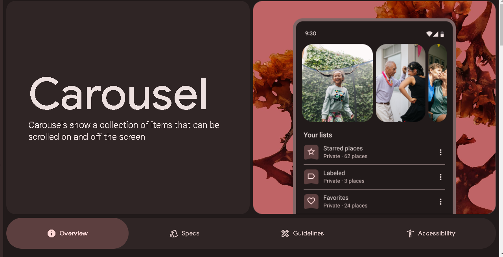

# Carousel

| Imagen 1 | Imagen 2 | Imagen 3 |
| -------- | -------- | -------- | 
|  |  | 

# Demostracion 

  

## Instrucciones de Uso

1. Clone el repositorio.
2. Instala las dependencias.
3. Ejecuta la aplicación.

¡Espero que disfrutes del video y encuentres el proyecto interesante!
